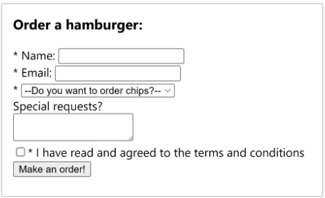

# Week 4: Getting Started with React  
  
We are using [create-react-app](https://create-react-app.dev/docs/getting-started). To do so, make sure it is installed, and then just call it with `npx create-react-app`...
  
i.e.
```
# install
npm install create-react-app

# create a new app
npx create-react-app my-app

# cd into the app, if you'd like
cd my-app
```

Inside the `app.js`, we have a function `App()`. That is rendered oin the index.js. Let's add another component `<Lol />` to the return value of `App()` and a function to support it.  
  
```js
function Lol(props) {
  return (
    <div>
      <p>Hello from me. My name is {props.name}!</p>
      <p>I live in {props.city}.</p>
    </div>
  )
}
```
Add it to the `App()` return value:  
  
```js
function App() {
  return (
      <div class="container">
        <h1>Hello World!</h1>
        <Lol name="Drew" city="Vancouver"/>
      </div>
  );
}
```

## Props & Components in other Files  
  
You can create a component in another file, just make sure to export it, and import what you need. For example, we can create the function `PassengerTickets` in the `PassengerTicket.js` file, then import it with `import PassengerTicket from './PassengerTicket';`  
  
```js
function PassengerTicket(props) {
    return (
        <div className="Passenger-Tickets">
        <h2>Passenger Ticket</h2>
        <p>Name: {props.name}</p>
        <p>Destination: {props.destination}</p>
        <p>Greeting: {props.greeting}</p>
        <p>Seat: {props.seat}</p>
        </div>
    );
}

export default PassengerTicket;
```

Add it to the `App.js` return value:
```js
function App() {
  return (
      <div class="container">
        <h1>Hello World!</h1>
        <Lol name="Drew" city="Vancouver"/>
        <PassengerTicket name="Drew" destination="Hawaii" greeting="Dr" seat="44A"/>
      </div>
  );
}
```

## React Router  
  
  - [React Router](https://reactrouter.com/)  
    
To use react router, just `npm install react-router-dom` and make sure to import it into your app!  
  
```sh
npm install react-router-dom
```

Wrap the `<App />` component in your `index.js` with `<BrowserRouter></BrowserRouter>` tags like so:  
  
```js
//... 
import { BrowserRouter } from 'react-router-dom';

const root = ReactDOM.createRoot(document.getElementById('root'));
root.render(
  <React.StrictMode>
    <BrowserRouter>
      <App />
    </BrowserRouter>
  </React.StrictMode>
);
```
**NOTE**: The docs show this a little differently (BONUS: experiment with both. What is different?)

```js
ReactDOM.createRoot(document.getElementById("root")).render(
  <React.StrictMode>
    <RouterProvider router={router} />
  </React.StrictMode>
);
```

## Exercise 16 Instructions  
  
In this exercise, you’ll build a simple website using React Router.  
  1. Create three components: Home, Profile, and Login. Each component should render some simple content, such as a heading and a paragraph.
  2. Create a Navbar component that displays links to the Home, Login and Profile components.
  3. Use React Router to create routes for each of the components. The Home component should be the default route.
  4. The Login component will contain inputs of username and password.  
   
## Exercise 18 Instructions  
  
Here's an uncontrolled component example of a form: 

```js
const emailRef = useRef();
const handleSubmit = event => alert(emailRef.current.value);

return <form onSubmit={handleSubmit}>
    Email:
    <input type="email" ref={emailRef} />
    <button type="submit">Submit</button>
</form>;
```
and a controlled component form example:  
  
```js
const [email,setEmail] = useState('');
const handleSubmit = () => alert(email);

return <form onSubmit={handleSubmit}>
    Email:
    <input type="email" value={email}
        onChange={(e) => setEmail(e.target.value)}/>
    <button type="submit">Submit</button>
</form>;
```
  
Create a form to order a hamburger with the fields matching the screenshot:  
  
  

  - Validate there are no empty fields when the form is submitted.  
  - If there nothing missing, display an alert with the order details. Otherwise display an alert that there are empty fields.
