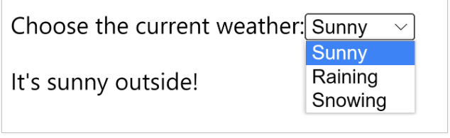
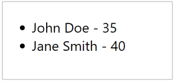
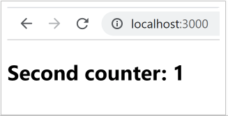
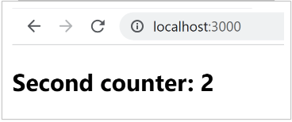
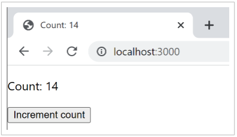
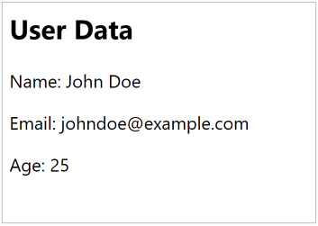

# Week 5 Exercises  
  
- [Context Hook](https://react.dev/reference/react/useContext)  
  
## Exercise 06  

Display a user’s name, email, and age.

Add a condition to the component so that it only displays the user’s age if their age is greater than 18. If the user’s age is less than 18, display a message saying “Sorry, you are too young to view this information.”

Example of user object:
```js
const user = {
    name: 'John Doe',
    email: 'johndoe@example.com',
    age: 14,
};
```

## Exercise 07  
  
Create a select that allows users to check the current weather condition (sunny, raining, or snowing) and passes this value to a WeatherDisplay component as a prop.

In the WeatherDisplay component, add a condition to display either a message saying “It’s sunny outside!” if the weather is sunny, or a message saying “Bring an umbrella, it’s raining!” if the weather is raining. Add a third condition to display a message saying “It’s snowing outside! Bundle up!” if the weather is snowing.  

  

## Exercise 08  

Create a new component called Menu.  

Inside this component, create an array called users that contains multiple user objects. Each object should have a properties for name and age.  

Example:
```js
[{ name: 'John Doe', age: 35 }, { name: 'Jane Smith', age: 40 }]
```  

Use the map method to render the list.  
  
*Assign a unique key to each list item using the index parameter.  
  
  
  

## Exercise 09  

Create a seconds counter.  
  
- The "seconds" state initialized to 0
- Every one second (1000 milliseconds) the "seconds" state increments by 1
- Use `useState` and `useEffect` hooks
- Use `setInterval`
- Use the `clearInterval` function to clean up the interval when the component is unmounted.  

  
  
  

## Exercise 10  
Create an app that renders a counter and a button to increment it.  

Update the document title with the current count.  

The count state initialized to 0.  
  

  
## Exercise 11  
  
Create a new React context using the createContext function. This will be the User Context.  

In the User Context, define an initial user object with the properties name, email, and age.  

Create a UserProvider component that wraps a UserDisplay component.  

Inside it show user’s data.  


  